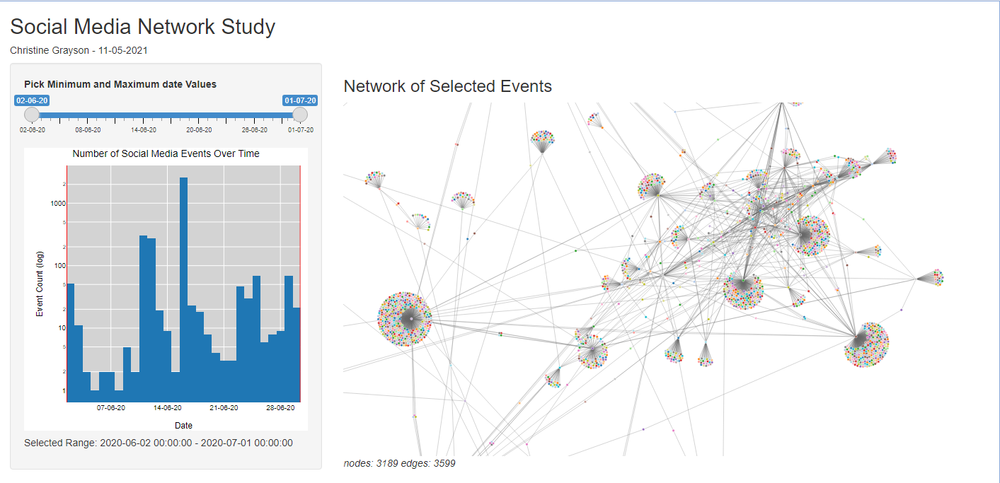
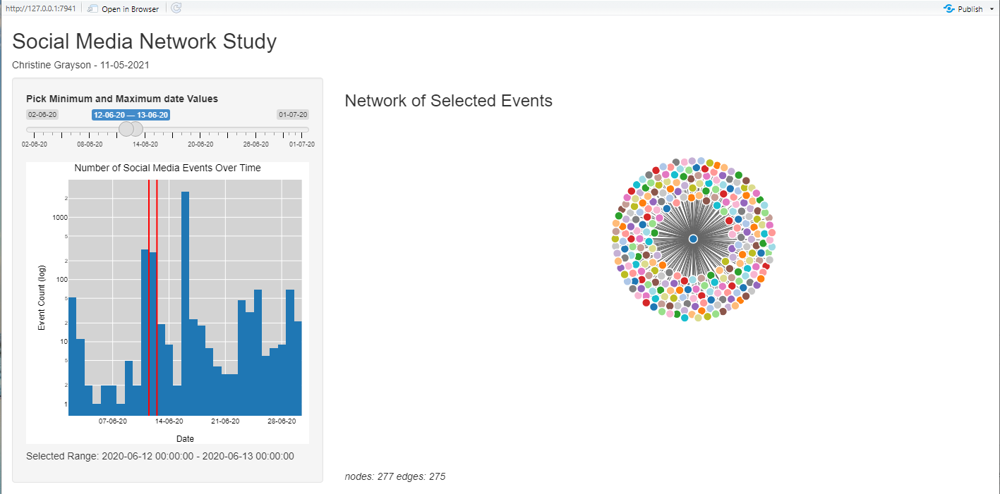

Developing Data Products: Course Project
========================================================
 

Overview
========================================================

This presentation has been created for the final project in the Coursera course "Developing Data Products". 

Included in this project are:

- This README, providing an overview, code examples and links
- A presentation created in R Markdown 
- Code for the Shiny app also hosted on shinyapp.io
- The source code etc.

Important links are shown at the bottom of the page

Introduction
========================================================

Currently I work on a research project to study the spread of information on social media, so I had an idea to create an app that would help me with my work.

The idea of this interactive graph is to be able to peer into the event network at user defined time ranges to see what type of connections there are.

This app is intended to answer such questions as "are peaks in activity due to many users sending to many other users or are there just a few super users or bots sending to many users?"

Data
========================================================

One of the hardest problems in completing this project was producing the data. 

It was not possible to use data from the project as it is restricted, so synthetic data had to be created. 

It was possible to get edge data quite easily, but data that included date information seemed hard to find. 

Eventually it was decided to use an open source edge list from [here](http://datasets.syr.edu/datasets/Flickr.html) and apply dates by hand using excel.

## How it Works

A plotly histogram of events over time is shown on the left. On the right is the network graph initially depicting all the events.

The user can then select date ranges using the slider above the histogram. 

The events in that time range are used to create a network graph.

The user can interact with the network graphic, the mouse scroll can be used zoom in and out, left click to pan.

Screen Shots
========================================================





server.R
========================================================


```r
server <- function(input, output) {
    
    output$distPlot <- renderPlotly({
        
        vline <- function(x = 0, color = "red") {
            list(
                type = "line", 
                y0 = 0, 
                y1 = 1, 
                yref = "paper",
                x0 = x, 
                x1 = x, 
                line = list(color = color)
            )
        }
        
        sl <- input$sliderx[1] - hours(12)
        sr <- input$sliderx[2] - hours(12)
        
        event_plot <- sm_data %>%
            #plot_ly(x = ~(as.numeric(date) * 1000), type = 'histogram', nbinsx = input$bins)  %>%
            plot_ly(x = ~as.Date(date), type = 'histogram', nbinsx = 29)  %>%
            layout(title = "Number of Social Media Events Over Time",
                   shapes = list(vline(sl),vline(sr)),
                   coloraxis=list(colorscale='RdBu'), 
                   showlegend = FALSE, 
                   plot_bgcolor='#D3D3D3',
                   font = list(family = 'Arial',
                               size = 10,
                               color = '#000000'),
                   xaxis = list( 
                       range=c(datex1 - hours(12),datex2 - hours(12)),
                       type="date",
                       tickformat = '%d-%m-%y',
                       title = 'Date',
                       zerolinecolor = '#ffff', 
                       zerolinewidth = 2,
                       gridcolor = 'ffff'), 
                   yaxis = list( 
                       type = "log",
                       title = 'Event Count (log)',
                       axis_tickformat = "0.1r",
                       zerolinecolor = '#ffff', 
                       zerolinewidth = 2, 
                       gridcolor = 'ffff'))
        
    })
    
    output$net <- renderForceNetwork({
        
        # in case validation errors occur
        output$stats <- renderText("nodes: 0 edges: 0")
        # Apparently naming collisions are common in validate
        shiny::validate(
            need(input$sliderx[1] != input$sliderx[2], "Please select a valid date range")
        )
        
        output$s1 <- renderText({ paste0("Selected Range: ",format(input$sliderx[1],"%Y-%m-%d %H:%M:%S"),
                                         " - ",format(input$sliderx[2],"%Y-%m-%d %H:%M:%S")) })
        
        sub_sm <- sm_data[sm_data$date >= input$sliderx[1] & sm_data$date < input$sliderx[2],]
        
        # create node list
        sources <- sub_sm %>%
            distinct(parent) %>%
            rename(label = parent)
        
        destinations <- sub_sm %>%
            distinct(child) %>%
            rename(label = child)
        
        nodes <- full_join(sources, destinations, by = "label")
        nodes <- nodes %>% rowid_to_column("id")
        #nodes
        
        # create edge list
        event_edgelist <- sub_sm %>%  
            group_by(parent, child) %>%
            summarise(weight = n()) %>% 
            ungroup()
        
        edges <- event_edgelist %>% 
            left_join(nodes, by = c("parent" = "label")) %>% 
            rename(from = id)
        
        edges <- edges %>% 
            left_join(nodes, by = c("child" = "label")) %>% 
            rename(to = id)
        
        edges <- select(edges, from, to, weight)
        output$stats <- renderText(paste0("nodes: ", nrow(nodes), " edges: ", nrow(edges)))
        #edges
        
        nodes_d3 <- mutate(nodes, id = id - 1)
        edges_d3 <- mutate(edges, from = from - 1, to = to - 1)
        
        forceNetwork(Links = edges_d3, Nodes = nodes_d3, Source = "from", Target = "to", 
                     NodeID = "label", Group = "id", Value = "weight", 
                     opacity = 1, fontSize = 16, zoom = TRUE)
    })
}
```

ui.R
========================================================
```r
ui <- fluidPage(

    # Application title
    titlePanel("Social Media Network Study"),
    h5("Christine Grayson - 11-05-2021"),
    
    # Sidebar with a slider input for number of bins
    sidebarLayout(
        sidebarPanel(
            sliderInput("sliderx",
                        "Pick Minimum and Maximum date Values",
                        min = datex1,
                        max = datex2,
                        value=c(datex1, datex2),
                        timeFormat='%d-%m-%y'),
            plotlyOutput("distPlot"),
            h5(textOutput("s1"),textOutput("s2"))
        ),
        mainPanel(
            # Show a plot of the generated distribution
            h3("Network of Selected Events"),
            forceNetworkOutput(outputId = "net"),
            em(textOutput("stats"))
        )
    )
)
```

Links
========================================================
<li><a href="http://datasets.syr.edu/datasets/Flickr.html" target="_blank">The Source of Data</a></li>
<li><a href="https://github.com/graysonch/DevelopingDataProducts/tree/master/Week4FinalProject" target="_blank">The Project Source Code on Github</a></li>
<li><a href="https://graysonch.github.io/DevelopingDataProducts/Week4FinalProject/Week4FinalProjectPresentation.html#(1)" target="_blank">This Presentation on Github</a></li>
<li><a href="https://bootswatch.com/darkly/" target="_blank">The Theme Used for the Presentation</a></li>
<li><a href="https://graysonch.shinyapps.io/week4finalproject/" target="_blank">Link to the Deployed Shiny App</a></li>